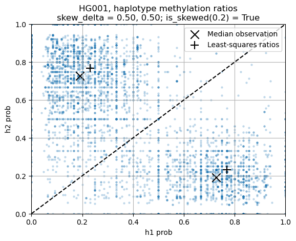

# Methods
The primary function of the `SampleXCI.py` script is to detect and quantify X-Chromosome Inactivation (XCI) skewing in a HiFi dataset.
At a high level, the tool iterates over a selection of CpGs associated with XCI and extracts the number of read mappings that are methylated or unmethylated as well as the haplotype (h1 or h2) that it is on.
These values are then used as observations to calculate whether methylation status is skewed towards a haplotype.

## Extracting methylation status
Extracting the methylation status of reads at each locus is a pre-processing step performed by [pb-CpG-tools](https://github.com/PacificBiosciences/pb-CpG-tools).
In brief, this tool iterates over all of the reads in a HiFi dataset and categorizes each CpG in the read as methylated or unmethylated. 
The tool then aggregates then status of the CpGs at genomic coordinates in a pileup. 
In addition to the overall pileup, it will also generate haplotype-specific pileups that serve as the primary input to this tool.
These haplotype pileups are limited in the same way that the upstream phasing tool is limited.

## Building the XCI-associated CpGs profile
We built a profile of XCI-associated CpGs by taking the haplotype-specific CpG pileups for a collections of samples and filtering them with a set of criteria:

1. Depth at the locus - For a individual sample CpG to be counted, we required it to have a minimum total read depth of 10.
2. CpG in males is unmethylated - For our male samples, the CpG required a methylation ratio < 20% to be counted.
3. CpG in females is half methylated - For our female samples, the CpG required a methylations in the range of [30%, 70%] to be counted.
4. Minimum sample count - For a CpG locus to be included in the final profile, we required that 75% of male samples and 75% of females samples matched the above criteria. Functionally, this means a CpG goes into the XCI-associated profile if it is consistently covered across the samples AND male sample CpGs are consistently open (unmethylated) AND female sample CpGs are consistently half-open (one is active and one is inactive, which is expected in XCI).

We used a mix of blood samples (Human Pangenome Reference Consortium, HPRC, 10 samples) and cell lines (65 samples) that were all sequenced with PacBio HiFi reads.
There were a total of 30 males and 45 females in this collection.
After filtering as described above, there were a total of 5,642 informative CpGs remaining which are available in [count_informative_cpgs.bed.gz](../data/count_informative_cpgs.bed.gz).
The majority of these tend to cluster around the 5' ends of annotated RefSeq genes.
The following IGV screenshot shows an example chrX region with the informative XCI CpGs in the top track and annotated RefSeq genes below it.
There are six cluster of CpGs in the XCI informative set here, and all of them are near the start exon of an annotated gene.

## Data XCI skew calculation
Given the XCI-associated CpG profile and the CpG pileup for a dataset, the final step calculates XCI skew by extracting all the loci from the pileup that are in the XCI-associated CpG profile and analyzing the relative methylation ratios in haplotype 1 and 2.
Each CpG is extracted and the read counts are converted to methylation ratios (e.g., methylated_count / total_count) for both haplotype 1 and 2.
Then, the collection of CpGs is analyzed to generate the summary statistics that are described in our [user guide outputs](./user_guide.md#output-files).
In general, we focus on two types of metrics: ratio metrics that define where the likely skew ratios are and delta metrics that describe the difference between the two ratios.
In an unskewed sample, we expect the ratios to be roughly equal (i.e., 50:50) which would correspond to a delta of 0.0.
In practice, we find that a delta greater than 0.2 (or ratio skewed at least 40:60) typically corresponds to a sample with a skewed X-inactivation profile.
Delta values less than 0.2 may also be skewed, but it is difficult to distinguish that low level of skewing from background noise.

In the figure below, the sample ratios are marked with a "+" symbol and the delta value (0.50) is shown on the top of the figure.
This sample has a skewing ratio of approximately 25:75, indicating that one chrX is selected for inactivation roughly 3x more frequently than the other chrX.

