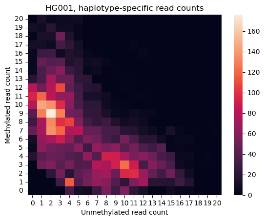

# User Guide
Table of contents:

* [Quickstart](#quickstart)
* [Common uses cases](#common-use-cases)
* [Supported upstream processes](#supported-upstream-processes)
* [Output files](#output-files)

# Quickstart
Prior to running XiSkewAnalysis, [pb-CpG-tools](https://github.com/PacificBiosciences/pb-CpG-tools) must be run on a haplotagged BAM file to generate CpG pileup files.
See [Supported upstream processes](#supported-upstream-processes) for more details.

Once the pileups are generated, this command will generate the XCI results:
```bash
python3 ./scripts/SampleXCI.py \
    {input.pileup_prefix} \
    {input.xci_bed} \
    {output.xci_prefix}
```

Parameters:
* `{input.pileup_prefix}` - prefix of the outputs from `pb-CpG-tools`
* `{input.xci_bed}` - the path to the XCI loci BED file, [data/count_informative_cpgs.bed.gz](../data/count_informative_cpgs.bed.gz) in this repository
* `{output.xci_prefix}` - prefix of the output files from the script

# Common use cases
## Generating output images
The `SampleXCI.py` script can optionally generate visualizations of the CpG methylation distributions as part of the analysis.
This can be specified by adding the `--images` option and an optional `--sample-name` to go on the images.  For example:
```bash
python3 ./scripts/SampleXCI.py \
    --images --sample-name "my_sample" \
    {input.pileup_prefix} \
    {input.xci_bed} \
    {output.xci_prefix}
```

This will generate two figures: 
1. `{prefix}.hapscat.png` - contains a haplotype scatter plot comparing the methylation status of each locus for haplotype 1 and 2
2. `{prefix}.read_counts.png` - a heatmap of the methylated / unmethylated read counts for all loci, each haplotype is counted once in the image

Examples of each are below:



## Overlay phase blocks
The `SampleXCI.py` script can optionally group loci by their corresponding phase block ID.
This can be enabled by adding the `--phase-blocks` option and providing the phase block TSV file from [HiPhase](https://github.com/PacificBiosciences/HiPhase) or [WhatsHap](https://github.com/whatshap/whatshap).
For example:
```bash
python3 ./scripts/SampleXCI.py \
    --phase-blocks {input.blocks} \
    {input.pileup_prefix} \
    {input.xci_bed} \
    {output.xci_prefix}
```

This will cause the script to generate all of the same outputs as before and an additional `{prefix}.phased_xci_summary.json` which has the same format as `{prefix}.xci_summary.json`.
This file is generated by first collapsing all individual CpG loci into one observation for the phase block.
Read counts for each state and haplotype are added together into values for the whole phase block, and then all calculations are performed in an identical manner as before.
We note that each phase block will represent a variable number of CpG loci which may lead to biases if unweighted metrics are used.
An example output file is available at [HG001.phased_xci_summary.json](./example/HG001.phased_xci_summary.json).

# Supported upstream processes
Prior to running XiSkewAnalysis, [pb-CpG-tools](https://github.com/PacificBiosciences/pb-CpG-tools) must be run on a haplotagged BAM file to generate CpG pileup files.
This command will generate the pileup files required:
```bash
aligned_bam_to_cpg_scores \
    --bam {input.bam} \
    --pileup-mode count \
    --output-prefix {output.pileup_prefix} \
    --threads {threads}
```

Parameters:
* `{input.bam}` - the haplotagged BAM file for a dataset
* `{output.pileup_prefix}` - the output prefix for all outputs from `aligned_bam_to_cpg_scores`
* `{threads}` - optional number of threads to use for the computation

# Output files
## XCI summary JSON
The primary output from `SampleXCI.py` is a JSON file containing summary skew metrics for the dataset.
A full example is available in [HG001.xci_summary.json](./example/HG001.xci_summary.json).
Details on how each metrics is calculated are described here:

* `cluster_center` - Conceptually, this value represents the cluster center if one generated the [haplotype scatter plot](#generating-output-images) and mirrored all results to be below the `y=x` line (we do this because h1 and h2 are arbitrarily assigned). Mean, median, and weighted mean by read depth are all calculated. We expect these values to add to 1.0, but they are typically less than 1.0.
* `delta` - Conceptually, this value represent the ratio difference between h1 and h2. Each locus has an individual delta value that is summarized across all loci with mean, median, and weighted mean in this file. In an unskewed sample, we expect these values to be near 0, whereas a heavily skewed sample will be near 1.0.
* `skew_threshold` - A constant 0.2, indicating the minimum `delta` median value to mark a sample as skewed. This heuristic was generated by inspecting results from our data collection and selecting a cutoff. We note that samples with a skew value below 0.2 may still be skewed, but it is difficult to determine whether the delta is just noise or a true skew.
* `is_skewed` - Boolean marker indicating whether a sample has XCI skew based on a `delta` median value > `skew_threshold`. 
* `linalg_result` - The estimated skew ratios (`ratio1` and `ratio2`, which sum to 1.0) and error term (`error`) and for the dataset. These are derived by applying a linear algebra equation to the median skew ratios across all loci.
* `lstsq_result` - Same as `linalg_result`, but using a least-squares solution that factors in all loci, not just the median values.
* `w_lstsq_result` - Same as `lstsq_result`, but using a weighted least-squares solution based on read depth.
